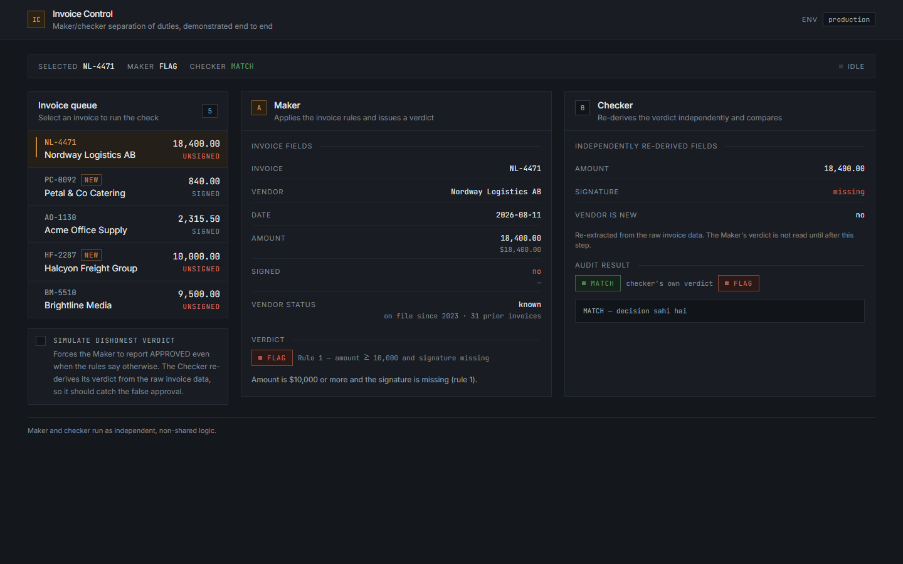
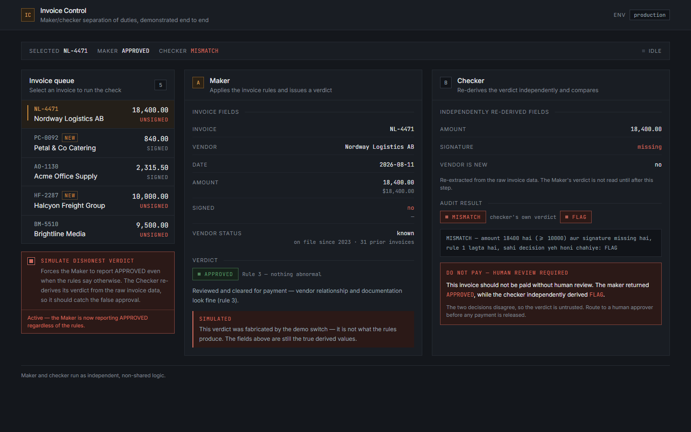
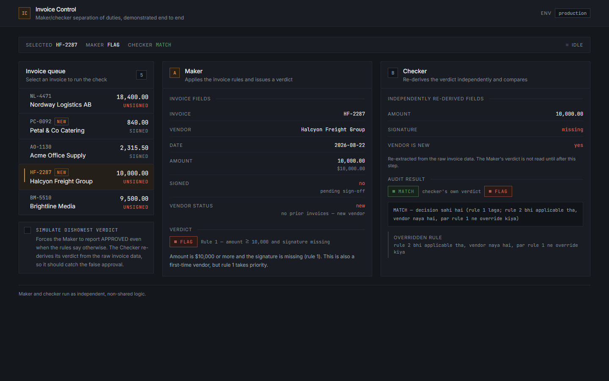
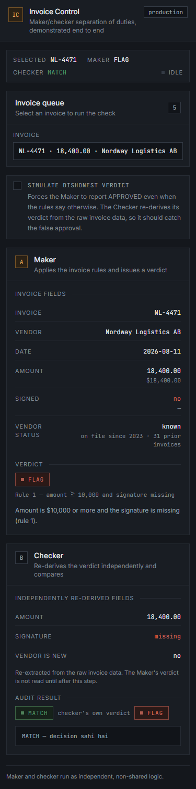

# Invoice Control

**A working demonstration of the maker/checker pattern: one process decides whether an invoice should be paid, and a second, independent process re-derives the same decision from the raw data and catches it when it's wrong.**

There's a switch in the UI that forces the first process to lie. The second one catches it every time.

---

## Live demo

**https://invoice-control-demo.vercel.app/**

Try this: select **NL-4471**, then turn on **Simulate dishonest verdict**. The Maker panel will claim the invoice is `APPROVED`. The Checker panel will disagree, show you exactly which rule was broken, and refuse to let the payment through.

---

## What this demonstrates

In finance and operations, the rule that stops most fraud and most expensive mistakes isn't a clever algorithm. It's a boundary: **the person who prepares a payment is never the person who approves it.** Two sets of eyes, two independent judgements. It's called separation of duties, or the four-eyes principle, and it's why your company's expense system makes someone else sign off on your reimbursement.

The reason it works is subtle and worth being precise about. It isn't that two people are smarter than one. It's that the *second* judgement is made **without being shown the first one's reasoning**. If the checker starts by reading the maker's conclusion, the checker's job silently collapses into "does this sound plausible?" — and plausible-sounding wrong answers sail straight through. The check only has teeth if it's derived independently.

This project takes that idea and makes it something you can watch happen:

- **The Maker** reads an invoice and issues a verdict — `FLAG`, `REVIEW NEEDED`, or `APPROVED`.
- **The Checker** gets the same raw invoice and, separately, the Maker's verdict. It re-reads every field itself, applies the rules itself, and reaches its own conclusion **before** it ever looks at what the Maker said. Only then does it compare.
- If the two disagree, the invoice is blocked with a do-not-pay warning. A disagreement doesn't mean the Checker is right — it means the verdict is untrusted, and a human has to look.

The **Simulate dishonest verdict** switch is the point of the whole demo. It forces the Maker to report `APPROVED` no matter what the rules actually say. If the Checker were built the way most "validation" code is built — sharing a function with the thing it's validating — it would happily agree, because both sides would be running the same code and reaching the same wrong answer. Here it doesn't agree. That's the difference between real verification and a rubber stamp.

---

## Screenshots

| | |
| --- | --- |
|  | **Overview** — invoice `NL-4471` selected. $18,400 with no signature, so rule 1 fires. Maker says `FLAG`, Checker independently agrees: `MATCH`. |
|  | **The dishonest verdict, caught** — same invoice, demo switch on. The Maker claims `APPROVED`. The Checker re-derives `FLAG` from the raw data, reports `MISMATCH`, and blocks payment. |
|  | **Rule precedence** — invoice `HF-2287` sits at exactly $10,000 from a brand-new vendor. Two rules apply; rule 1 outranks rule 2. The Checker records the overridden rule as an audit note rather than quietly dropping it. |
|  | **375px** — the three columns collapse to one and the invoice queue becomes a native dropdown. |

The screenshots are generated, not hand-captured. To regenerate them after a UI change:

```bash
cd web
npm run dev            # in one terminal
npm run screenshots    # in another
```

`scripts/capture-screenshots.mjs` drives a real headless Chrome over the DevTools Protocol: it clicks the invoice, flips the switch, waits for both API stages to settle, reads the rendered state back to confirm it captured the right thing, and writes all five images to `/screenshots`.

---

## How it works

### The rules

Three rules, evaluated in order, first match wins:

| | Verdict | Condition |
| --- | --- | --- |
| 1 | `FLAG` | `amount >= 10000` **and** the signature is missing |
| 2 | `REVIEW NEEDED` | The vendor is new — first invoice from them |
| 3 | `APPROVE` | Everything else |

Two details do most of the work in this demo. **Rule 1 outranks rule 2**: a $10,000 unsigned invoice from a new vendor is `FLAG`, not `REVIEW NEEDED`. And **the threshold is inclusive**: exactly $10,000.00 triggers rule 1, not $10,000.01.

### The Skill — where the rules come from

The rules aren't invented in the application code. They live in [`.claude/skills/invoice-checker/SKILL.md`](.claude/skills/invoice-checker/SKILL.md).

A **Skill** is a plain Markdown file that gives an AI agent a specific, repeatable competence. It states what to do, when to do it, which fields to gather, what the rules are, how to format the answer, and where the edge cases are — in prose, not code. Its frontmatter (`name`, `description`) tells the agent when the Skill is relevant, so it activates on "can you check this invoice?" without the user knowing a Skill exists.

The point is that the rules live somewhere a finance lead can read and edit. Changing the approval threshold is editing one line of Markdown, not filing a ticket against a codebase.

That file is the specification. This web app is an implementation of it.

### The subagent — the independent checker

[`.claude/agents/invoice-checker-verifier.md`](.claude/agents/invoice-checker-verifier.md) defines a **subagent**: a separate agent with its own instructions, its own context window, and a deliberately narrow toolset (`Read`, `Glob`, `Grep` — it can look at things, it can't change them).

Separateness is the entire feature. A subagent doesn't inherit the reasoning of the agent that called it. It can't be quietly influenced by how confidently the first agent phrased its conclusion, because it never sees that conversation — it sees only the raw invoice and the verdict it's been asked to audit.

The instructions are blunt about what that means in practice:

> The given decision is **evidence of nothing**. Treat it as an unverified claim by a party that may be wrong.
>
> - **Derive your own verdict first, before you read the given decision or its reasoning.**
> - Never reuse the other agent's normalized numbers, its "signature: missing" call, or its "new vendor" call. Re-extract every field from the raw invoice data yourself.
> - If the given reasoning sounds convincing, that changes nothing.
> - Do not soften a MISMATCH to avoid contradicting the other agent, and do not manufacture one to look thorough.

It also has to leave an audit trail. When rule 1 fires on an invoice whose vendor is *also* new, rule 2 was suppressed — and the Checker has to say so out loud, on a `MATCH` as well as a `MISMATCH`. That's why the Checker panel in screenshot 3 shows an "Overridden rule" note: a correct verdict that hides a suppressed rule is still a worse audit record than one that names it.

### The two API routes

The web app mirrors that structure with two route handlers that talk to each other only through HTTP:

| Route | Plays the part of | What it does |
| --- | --- | --- |
| [`app/api/check-invoice/route.ts`](web/app/api/check-invoice/route.ts) | the Maker (the Skill) | Normalizes the raw fields, applies the three rules, returns a verdict, a one-line reason, and which rule fired. Honours `simulateDishonest` by returning a confident, fabricated `APPROVE`. |
| [`app/api/verify-invoice/route.ts`](web/app/api/verify-invoice/route.ts) | the Checker (the subagent) | Re-extracts every field from the raw invoice, derives its own verdict, and only then compares against the verdict under audit. Returns `MATCH` / `MISMATCH` and the Checker's own line. |

**The two routes do not share any rule code.** Not the threshold constant, not the amount parser, not the signature detector, not the rule ladder. They share only TypeScript `type` declarations — the shape of the messages, never the logic that produces them.

That is a deliberate design decision, and it's the one thing in this repo worth arguing about. The reasoning is in the subagent spec:

> These rules are intentionally duplicated from the `invoice-checker` skill rather than read from it, so that verification does not depend on the file being audited.

A shared `evaluate()` function would look like better engineering and would quietly destroy the product. Two callers of one function cannot disagree. The disagreement *is* the feature — so the second implementation has to be a second implementation.

Note also what the Checker is *not* given. It receives the raw invoice and the claimed verdict. It does not receive the Maker's normalized amount, its signature call, or its new-vendor call. If it accepted those, it would be auditing the Maker's arithmetic using the Maker's arithmetic.

---

## Tech stack

- **Next.js 14.2.35** — App Router, with the two checks as route handlers
- **TypeScript** — strict mode, no `any` in application code
- **Tailwind CSS** — custom graphite/amber theme, flat surfaces, no gradients or shadows
- **React 18.3** — client-side orchestration of the two-stage pipeline
- **Vercel** — deployment target; zero extra configuration needed

No database, no auth, no external API calls. The five sample invoices are a static fixture, so the demo can't break in front of an audience.

---

## Project structure

```
invoice-checker-demo/
├── .claude/
│   ├── skills/invoice-checker/SKILL.md      # The rules, in prose. Source of truth.
│   └── agents/invoice-checker-verifier.md   # The independent auditor's instructions.
├── screenshots/                             # Generated by `npm run screenshots`.
├── LICENSE
└── web/
    ├── app/
    │   ├── api/check-invoice/route.ts        # MAKER — applies the rules, issues a verdict.
    │   ├── api/verify-invoice/route.ts       # CHECKER — re-derives independently, then compares.
    │   ├── page.tsx                          # Orchestrates maker → checker; owns loading/error state.
    │   ├── layout.tsx                        # Fonts, metadata, Open Graph tags.
    │   ├── globals.css                       # Tailwind layers + the .num / .label / skeleton primitives.
    │   ├── icon.svg                          # Favicon, amber on graphite.
    │   └── opengraph-image.tsx               # Generated 1200×630 social preview card.
    ├── components/
    │   ├── AppHeader.tsx                     # Product title, subtitle, live NODE_ENV badge.
    │   ├── InvoiceList.tsx                   # The queue: cards on desktop, native <select> under 640px.
    │   ├── InvoiceCard.tsx                   # One invoice row — id, vendor, amount, signed/new markers.
    │   ├── DishonestToggle.tsx               # The "make the Maker lie" switch.
    │   ├── Panel.tsx                         # Shared panel shell (letter chip, title, subtitle).
    │   ├── MakerPanel.tsx                    # Panel A — fields, verdict badge, one-line reason.
    │   ├── CheckerPanel.tsx                  # Panel B — re-derived fields, MATCH/MISMATCH, do-not-pay warning.
    │   ├── PanelStates.tsx                   # Empty / loading-skeleton / error states shared by both panels.
    │   ├── VerdictBadge.tsx                  # Verdict and outcome badges, and the one label map.
    │   └── FieldRow.tsx                      # Label + monospace value row.
    ├── lib/
    │   ├── invoices.json                     # The 5 sample invoices. Shared by the app and the smoke test.
    │   ├── invoices.ts                       # Loads the fixture; documents what each invoice proves.
    │   ├── types.ts                          # The shared contract — types only, deliberately no rule logic.
    │   └── format.ts                         # Amount formatting and a className joiner.
    ├── scripts/
    │   ├── smoke.mjs                         # 5 invoices × 2 modes against both routes.
    │   ├── capture-screenshots.mjs           # Drives headless Chrome to regenerate /screenshots.
    │   └── audit-responsive.mjs              # Measures real overflow at a true emulated viewport.
    ├── tailwind.config.ts                    # The palette: ink, line, ash, amber, verdict.
    └── .env.example                          # Documents that no environment variables are required.
```

---

## Running locally

```bash
cd web && npm install && npm run dev
```

Then open **http://localhost:3000**.

Other commands, all from `web/`:

```bash
npm run build        # production build
npm run typecheck    # tsc --noEmit
npm run smoke        # end-to-end check of both API routes (needs a server running)
npm run screenshots  # regenerate /screenshots (needs a server running)
```

---

## Testing

```bash
npm run dev     # in one terminal
npm run smoke   # in another
```

`scripts/smoke.mjs` runs all **5 invoices × 2 modes (honest and dishonest) against both API routes** and asserts the properties that actually matter — 95 assertions in total:

- **The expected verdicts are hand-derived from `SKILL.md`**, not from the code under test. If both routes drifted the same way, this is what would notice.
- **The Checker always reaches the rule-correct verdict**, in honest mode and dishonest mode alike. Being lied to must not change what it derives.
- **The two routes agree on all three derived fields** — amount, signature present, vendor is new — despite parsing them with separately written code. This is the check that keeps deliberate duplication from becoming accidental divergence.
- **Honest mode always produces `MATCH`.** No false alarms.
- **Dishonest mode always produces `MISMATCH`** on any invoice whose true verdict isn't `APPROVE`, and the Checker's output line names the correct verdict.
- **The overridden-rule note appears exactly when a rule was actually suppressed** — present for `HF-2287`, absent everywhere else.
- **Error paths hold.** No decision supplied → `NO_DECISION_SUPPLIED` with the Checker's own verdict. No raw invoice data → HTTP 400, because a decision must never be passed through unverified.
- **A regression case for the signature bug described below** — "signed by Donna Blankenship", $25,000, 8 prior invoices — must read as signed and `APPROVE`.

`scripts/audit-responsive.mjs` is a separate tool that measures genuine horizontal overflow at an emulated viewport, used for the 375px pass. (Chrome's `--window-size` is clamped to a minimum window width on Windows, so a 375px screenshot can be a *crop* of a wider render — which is misleading enough that it's worth having a tool that reports `scrollWidth - clientWidth` instead of asking you to eyeball it.)

---

## Design decisions

### Why the rules are duplicated instead of shared

This is the core thesis, so it's worth stating the objection first. Duplicating the rule logic across both routes violates DRY. There are now two amount parsers, two signature detectors, two copies of the `10000` threshold. A reviewer skimming the diff would reasonably ask why there isn't one `evaluate(invoice)` in `lib/`.

Because a shared function makes the product impossible.

If both routes called the same `evaluate()`, they would agree by construction — always, including when `evaluate()` is wrong. The Checker would return `MATCH` for every invoice forever, and it would be *correct to*, because it and the Maker would be the same computation wearing two hats. You wouldn't have verification. You'd have one calculation, called twice, reported twice, and a UI implying independent confirmation it never performed.

The generalisation is the part that transfers beyond this demo: **a check that shares an implementation with the thing it checks cannot detect an error in that implementation.** It can only detect bad inputs. Genuine verification has to be independently derived, or it's theatre. This is also why `lib/types.ts` shares the *shape* of the messages but none of the logic — and why that file carries a comment explaining what must never be added to it.

The real cost of this decision is drift: two implementations can fall out of sync silently. That cost is paid, not ignored — the smoke test asserts that both routes derive identical values for all three fields on all five invoices, so divergence fails loudly. Both source files also point at `SKILL.md` as the specification they're each transcribing.

### The signature-detection bug that independent verification actually caught

A concrete case, from building this.

Both routes decide whether an invoice is signed by looking for "unsigned" phrasing in the signature field. Each route has its own matcher, written separately. Both were originally unanchored alternations:

```ts
// Before — maker
const missingPhrase =
  /(unsigned|not\s+signed|no\s+sign-?off|pending\s+sign-?off|pending\s+signature|awaiting\s+signature|signature\s+missing|blank)/;
if (missingPhrase.test(value)) return false;

// Before — checker (independently written, wider list)
const unsignedPattern =
  /(unsigned|not\s+signed|no\s+sign-?off|pending\s+sign-?off|...|missing|blank|none|na|n\/a)/;
if (unsignedPattern.test(value)) return false;
```

Those read fine. They are also broken, and it took two independently written implementations sitting side by side to make it obvious.

Without anchors, every alternative matches *inside* longer words. `blank` is a substring of **Blankenship** — that one is in both routes. `na` is a substring of **Donna** — that one is in the Checker's wider list. So an invoice signed by *Donna Blankenship* was read as **unsigned**, and at $10,000 or more both routes would `FLAG` a perfectly valid, properly authorized payment. In production that's a real invoice sitting unpaid in an exceptions queue while a vendor chases it, and the audit trail says the signature was missing, which is false.

The fix is `\b` on both ends, so each alternative matches a whole word instead of a fragment:

```ts
// After — \b on purpose: an unbounded "blank" misreads a signer named
// "Blankenship", and "na" misreads "Donna", as an unsigned block.
const missingPhrase =
  /\b(unsigned|not\s+signed|no\s+sign-?off|pending\s+sign-?off|pending\s+signature|awaiting\s+signature|signature\s+missing|blank)\b/;
if (missingPhrase.test(value)) return false;
```

Fixed in all three places that make this call — both API routes and the display-only label in `InvoiceCard.tsx` — and pinned with a regression case in the smoke test.

Two things about this bug are worth noticing, because they're the argument for the whole pattern:

1. **Every sample invoice in the demo still passed.** None of the five fixtures has a signer whose name contains "na" or "blank". A test suite built only from the happy-path fixtures would have stayed green through this indefinitely.
2. **It was a bug in the *rules*, not in the data.** This is exactly the class of error a shared `evaluate()` is structurally blind to: both sides would have called the same broken matcher, agreed enthusiastically, and displayed `MATCH` next to a wrong `FLAG`.

The demo's premise is that independent verification catches real mistakes. This was a real mistake, in this repo, caught this way.

### Smaller calls

- **The dishonest Maker lies about its verdict, but not about its fields.** With the switch on, the Maker returns a fabricated `APPROVE` while the derived fields it displays stay truthful. You can see the contradiction inside Panel A — `SIGNED: no`, `$18,400.00`, verdict `APPROVED` — which is more instructive than a panel that lies consistently.
- **Nothing runs until you pick an invoice.** The panels open in an empty state rather than auto-selecting the first row, so the first thing you see is the app waiting for input rather than a result you didn't ask for.
- **Each stage holds its loading state for a moment** (`MIN_STAGE_MS`, 260ms). Both routes answer in single-digit milliseconds locally, so without it the maker → checker sequence is invisible and the skeletons flash as a glitch.
- **A disagreement blocks payment; it doesn't overrule the Maker.** The warning says the verdict is untrusted and needs a human. The Checker's job is to detect disagreement, not to win it.
- **Verdict wording differs by layer on purpose.** The API returns `APPROVE`, matching `SKILL.md`; the UI renders `APPROVED`, which is how a person would say it. One label map in `VerdictBadge.tsx` owns the translation.
- **No file paths in the UI.** The mapping from panels to `.claude/` files is documentation, which belongs here, not on a product screen.

---

## Deployment

Nothing to configure. Point Vercel at this repo, set the root directory to `web`, and deploy — App Router needs no `vercel.json`, and there are no environment variables to set (see [`web/.env.example`](web/.env.example)).

`.claude/` is intentionally **not** gitignored. The Skill and subagent definitions are the source of truth for the rules the two API routes implement, so anyone browsing the repo should be able to read them.

---

## License

MIT — see [LICENSE](LICENSE).
